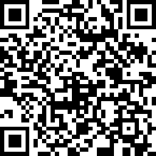

# GRPython_MicroPython

*NoSQL IoT Data Acquisition with Python Microservices with Cloud and Edge Computing.*

Demo Wifi:

- SSID: ```GRPUG_Demo```
- Password: ```0xdeadbeef```



## Project Setup.

  git clone https://github.com/jed-frey/GRPython_MicroPython.git
  git submodule update --init

Python is uses python3.7 and creates virtual environment in the GRPython_MicroPython folder. It is entirely contained to the checkout directory.

Removal: Delete ```GRPython_MicroPython```

# Repository Commands.

- ```make venv``` setup a virtual environment.
- ```make flash PORT=/dev/ttyUSB0``` flash micropython to ```/dev/ttyUSB0```.
- ```make hass``` Launch [Home Assistant](https://www.home-assistant.io/)
- ```make logger``` Launch the IoT data logger.

## Tools.

Additional tools:

[uPyLoader](File transfer and communication tool for MicroPython boards.)

Launch:

    make uPyLoader

[webrepl client](https://github.com/micropython/webrepl)

Launch:

  make webrepl

### Test Environment

- Ubuntu 18.04LTS
- Python 3.7
- Dell M6700
- RaspberryPi & RaspbianBuster
